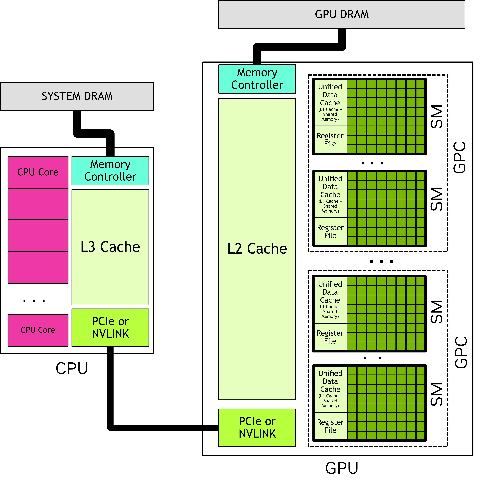
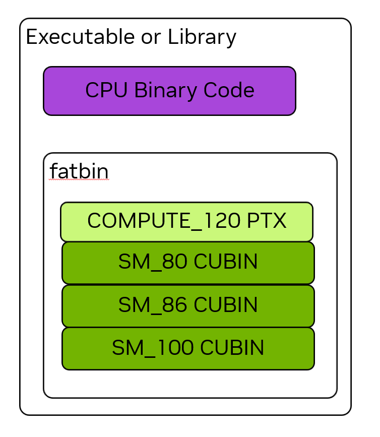

# CUDA Fundamentals

## Architecture and Modeling

### Architecture

GPUs offer significantly more data processing cores than CPUs with the same number of total transistors.
Unlike CPUs, multiple GPU cores share a single control unit and L1 cache, which explains why control flow divergence causes more significant performance degradation on GPU platforms.

The CUDA platform provides a native API for interacting with GPU devices, while libraries such as cuBLAS, cuFFT, and CUTLASS simplify development. Frameworks like PyTorch and TensorFlow provide built-in GPU acceleration. There are also DSLs such as NVIDIA's Warp and OpenAI's Triton that compile directly for GPUs.

When using CUDA, the programming model assumes a heterogeneous system with both CPUs and GPUs, whether on the same SoC or on separate devices. CUDA applications always start on the CPU.

**Terms:**
- **Host Code**: The host code (running on the CPU) uses CUDA APIs to copy data between host memory (typically DRAM) and device memory (typically on-board GDDR), launch kernels on the GPU, and synchronize or wait for transfers/compute. CPUs and GPUs may run concurrently.
- **Kernel**: A function launched by the host to execute on the GPU.
- **Device Code**: Code that runs on the GPU.
- **Launching**: The act of starting a kernel; this is called a "launch".

### Hardware Layout

- *Streaming Multiprocessors* (SM) contains the real calculation core.
- *Graphics Processing Clusters* (GPC) is a collection of SMs.
- *GPU* is a set of GPCs connected to the GPU memory.
- *PCIe/NVLINK* or other forms of interconnect is used to connect a CPU with a GPU

### Hardware Model

- Applications launches kernel on many *threads*
- Threads are organized into *blocks*
- Blocks are organized into *grids*

All the thread blocks in a grid have the *same size and dimensions*.

Thread blocks and grids may be 1, 2 or 3 dimensional to simplify mapping of threads to work items.
The execution is configured when a kernel is launched, specifying the grid and thread block dimensions.
The *execution configuration* may also include other parameters such as cluster size, stream and SM configurations.

There are some built-in variables containing the metadata of a kernel, containing its location, etc.

All threads of a thread block are executed in *a single SM*.
There is no guarantee of scheduling between thread blocks, so a thread block cannot rely on results from other thread blocks.

*Clusters* are a group of thread blocks which can be laid out in 1, 2 or 3 dimensions.
Specifying clusters does not change the grid dimensions or the indices of a thread block within a grid.

Threads in different blocks but within the same cluster can communicate and synchronize with each other using software interfaces provided by Cooperative Groups.

### SIMT

Threads are organized into groups of 32 threads, or *warps*.
A warp executes the kernel code in a SIMT paradigm.
In SIMT, all threads in the warp are executing the same kernel code, but each thread may follow different branches through the code.
Threads do not need to follow the same execution path.

All threads in the warp execute the same instruction simultaneously.
Control flow branches will mask off threads not following, and vice versa.
So when threads within a warp follow the same path the utilization of a GPU is maximized.

### GPU Memory

In all GPU systems, each GPU has its own DRAM memory, called *global memory*, accessible to all SMs in the GPU.
CPU and GPU use a single unified virtual memory space, which means that the virtual memory address range for each GPU/CPU is unique.

Each SM has its own register file and shared memory which are not accessible to threads running on other SMs.
The *register file* stores local variables usually allocated by the compiler.
The *shared memory* is accessible by all threads within a thread block or cluster.
They could be used for exchanging data between threads.

Applications could explicitly allocate memory on GPU or CPU, which is only accessible for the specific device. Use CUDA API to copy between them.

# CUDA Platform

## Runtime and Compiler

CUDA has a invisible and fundamental layer called Parallel Thread Execution, PTX.
It's a high-level assembly language for NVIDIA GPUs, providing an abstraction layer over the physical ISA(instruction set architecture) of real hardware.

DSLs and compilers can generate PTX code as an intermediate representation (IR), and then use NVIDIA's compilation tools to produce executable binary code.

Although most of the time code are compiled ahead of time, CUDA offers a tool called **NVRTC** to compile c++ device code at runtime.

## Binaries

**Terms:**
- **CUDA Binary / cuBIN**: Compiled real binary from PTX
- **fatbin**: Container of cuBINs and PTX for multi-targets
