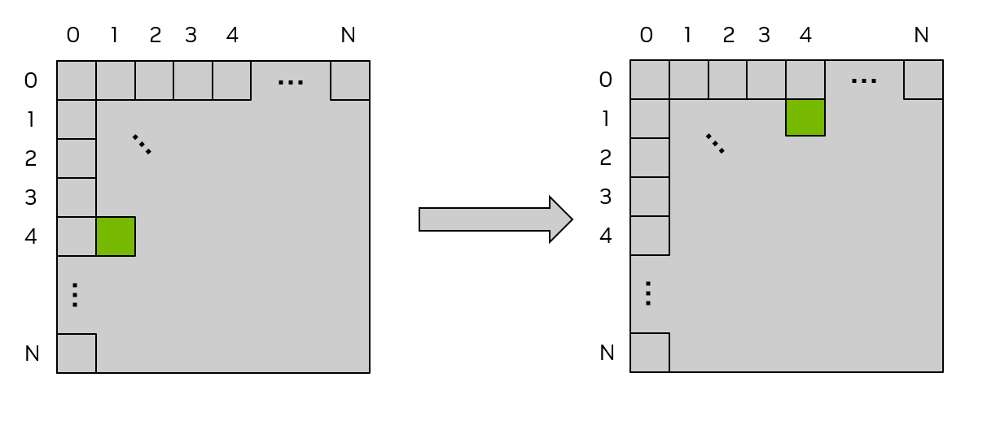
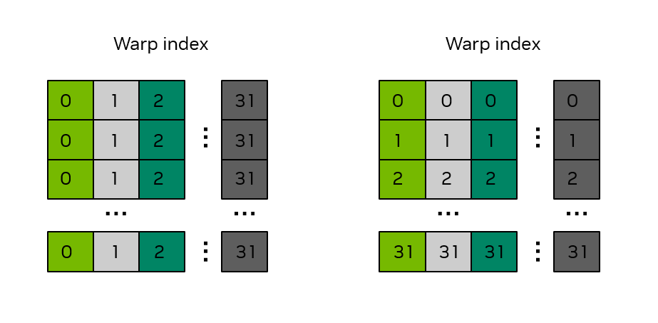
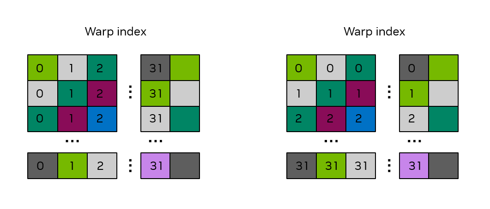

# CUDA SIMT Kernel

## Intrinsic variables

As discussed earlier, the common intrinsic variables available in CUDA kernels are:
- `gridDim.[x|y|z]`: grid size specified at kernel launch.
- `blockDim.[x|y|z]`: block size specified at kernel launch.
- `blockIdx.[x|y|z]`: index of the current block.
- `threadIdx.[x|y|z]`: index of the current thread within a block.

Note: using multi-dimensional blocks or grids usually does not improve performance by itself.

The linear thread index within a block is:
`threadIdx.x + threadIdx.y * blockDim.x + threadIdx.z * blockDim.x * blockDim.y`.
The same formula applies to compute a block's linear index.

## Memory

### Global memory

Global memory is the device memory accessible to all threads. Allocations persist until freed, the application exits, or `cudaDeviceReset` is called.

Global memory is the primary path for transferring data between host and device.

### Shared memory

Shared memory is a fast, explicitly managed memory region shared by threads inside the same block. Physically it resides on each SM and shares resources with L1 cache.

Use `__syncthreads()` to synchronize threads within a block when they cooperate via shared memory.

```cpp
// assuming blockDim.x is 128
__global__ void example_syncthreads(int* input_data, int* output_data) {
    __shared__ int shared_data[128];

    // Every thread writes to a distinct element of 'shared_data':
    shared_data[threadIdx.x] = input_data[threadIdx.x];

    // All threads synchronize, guaranteeing all writes to 'shared_data' are visible
    __syncthreads();

    // A single thread safely reads 'shared_data':
    if (threadIdx.x == 0) {
        int sum = 0;
        for (int i = 0; i < blockDim.x; ++i) {
            sum += shared_data[i];
        }
        output_data[blockIdx.x] = sum;
    }
}
```

Note: allocating shared memory can reduce the L1 cache available to a kernel. Inspect `cudaDeviceProp.sharedMemPerMultiprocessor` and `cudaDeviceProp.sharedMemPerBlock` to see device limits.

You can suggest a cache preference with `cudaFuncSetCacheConfig`, but the runtime may or may not honor it.

Declare static shared memory with `__shared__`, e.g. `__shared__ float sharedArray[1024];`.

#### Dynamic shared memory

The kernel launch syntax accepts an optional third parameter to request dynamic shared memory in bytes:

```cpp
vecAdd<<<grid, block, sharedMemoryBytes>>>(A, B, C);
```

Inside the kernel declare the buffer with `extern __shared__` and partition it using pointer arithmetic when needed. At most one dynamic shared buffer may be declared per kernel.

```cpp
extern __shared__ float array[];

short* array0 = (short*)array;
float* array1 = (float*)&array0[128];
int*   array2 =   (int*)&array1[64];
```

This can represent the equivalent of separate arrays such as:

```cpp
short array0[128];
float array1[64];
int   array2[256];
```

### Registers

Registers are per-thread, on-chip storage. Device properties expose register resources via `regsPerMultiprocessor` and `regsPerBlock`.

NVCC supports `-maxrregcount` to limit register usage per kernel.

### Local memory

Local memory is thread-local storage managed by the compiler; physically it may be placed in global memory when variables spill from registers. "Local" refers to scope, not physical location.

Compilers place non-constant arrays, large structures, or spilled registers into local memory.

### Constant memory

Constant memory is a small (typically 64KB) read-only device memory region with device-wide scope. Declare it on the host with `__constant__` outside functions and copy from host using `cudaMemcpyToSymbol`.

```cpp
// In your .cu file
__constant__ float coeffs[4];

__global__ void compute(float *out) {
    int idx = threadIdx.x;
    out[idx] = coeffs[0] * idx + coeffs[1];
}

// In your host code
float h_coeffs[4] = {1.0f, 2.0f, 3.0f, 4.0f};
cudaMemcpyToSymbol(coeffs, h_coeffs, sizeof(h_coeffs));
compute<<<1, 10>>>(device_out);
```

### Caches

Devices have L2 and L1 caches. L2 is shared across SMs; L1 is local to each SM and can share space with shared memory. Cache behavior is managed by the compiler and runtime.

### Distributed shared memory

This concept is provided by Cooperative Groups and is discussed elsewhere.

## Memory performance

### Coalesced memory access

Global memory accesses are issued as 32-byte transactions. The hardware coalesces per-warp memory requests into these transactions for efficiency.

For example, 32 threads each reading consecutive 4-byte words produce four 32-byte transactions (128 bytes total), which gives high utilization.

Note: consecutive thread indices accessing consecutive memory locations is the common pattern for coalescing, but other layouts can also be coalesced depending on access patterns.

Example: out-of-place matrix transpose (image below)


Run with a 32x32 block:

```cpp
/* macro to index a 1D memory array with 2D indices in row-major order */
/* ld is the leading dimension, i.e. the number of columns in the matrix     */

#define INDX( row, col, ld ) ( ( (row) * (ld) ) + (col) )

/* CUDA kernel for naive matrix transpose */

__global__ void naive_cuda_transpose(int m, float *a, float *c)
{
    int myCol = blockDim.x * blockIdx.x + threadIdx.x;
    int myRow = blockDim.y * blockIdx.y + threadIdx.y;

    if( myRow < m && myCol < m )
    {
        c[INDX( myCol, myRow, m )] = a[INDX( myRow, myCol, m )];
    }
    return;
}
```

In this kernel, reads from `a` are consecutive (fast). Writes to `c` are not consecutive when the leading dimension (`ld`) differs from the block width, causing poor write locality.

### Shared memory access and bank conflicts

Shared memory is organized into 32 banks (32-bit words). If multiple threads in a warp access different addresses that map to the same bank, accesses serialize and cause bank conflicts. Reading the same address is broadcast and avoids conflicts.

We can use shared memory as a tile buffer to avoid global memory uncoalesced writes. Example optimization:

```cpp
/* definitions of thread block size in X and Y directions */
#define THREADS_PER_BLOCK_X 32
#define THREADS_PER_BLOCK_Y 32

/* macro to index a 1D memory array with 2D indices in row-major order       */
/* ld is the leading dimension, i.e. the number of columns in the matrix     */
#define INDX( row, col, ld ) ( ( (row) * (ld) ) + (col) )

__global__ void smem_cuda_transpose(int m, float *a, float *c )
{

    /* declare a statically allocated shared memory array */
    __shared__ float smemArray[THREADS_PER_BLOCK_X][THREADS_PER_BLOCK_Y];

    /* determine row tile and column tile index */
    const int tileCol = blockDim.x * blockIdx.x;
    const int tileRow = blockDim.y * blockIdx.y;

    /* read from global memory into shared memory array */
    smemArray[threadIdx.x][threadIdx.y] = a[INDX( tileRow + threadIdx.y, tileCol + threadIdx.x, m )];

    /* synchronize the threads in the thread block */
    __syncthreads();

    /* write the result from shared memory to global memory */
    c[INDX( tileCol + threadIdx.y, tileRow + threadIdx.x, m )] = smemArray[threadIdx.y][threadIdx.x];
    return;

}
```

When reading into the tile we ensure global reads are coalesced. However, the initial layout can cause bank conflicts inside shared memory — padding the shared tile by one column commonly eliminates conflicts:

```cpp
__shared__ float smemArray[THREADS_PER_BLOCK_X][THREADS_PER_BLOCK_Y+1];
```

Images below illustrate the bank mapping and how padding removes conflicts:



## Atomics

Atomics provide ordered updates to shared device memory locations when many threads must update the same value. CUDA provides `cuda::std::atomic`, `cuda::std::atomic_ref`, and higher-level `cuda::atomic` utilities that allow specifying thread scope.

Example:

```cpp
__global__ void sumReduction(int n, float *array, float *result) {
   tid = threadIdx.x + blockIdx.x * blockDim.x;

   cuda::atomic_ref<float, cuda::thread_scope_device> result_ref(result);
   result_ref.fetch_add(array[tid]);
}
```

Use atomics sparingly: they serialize updates and can reduce performance.

## Cooperative Groups

Cooperative Groups enable creation of thread groups that can synchronize across blocks, grids, or even devices. They extend synchronization and communication capabilities beyond single-block `__syncthreads()` usage.

Details on Cooperative Groups are covered elsewhere.

## Kernel launch and occupancy

Do not rely on a fixed scheduling order for correctness; the CUDA scheduler assigns blocks to SMs dynamically.

Query hardware limits at runtime with `cudaGetDeviceProperties`. NVCC's `--resource-usage` flag reports register and shared memory usage for kernels.

