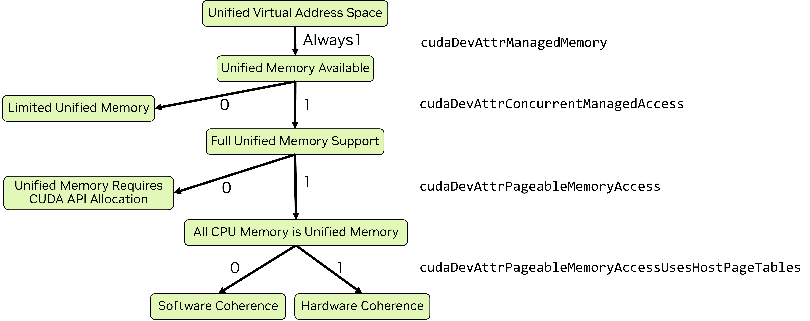

# CUDA Unified and System Memory

Unified memory is a CUDA feature that enables managed memory which can be automatically migrated between CPU and GPU.

## Unified Virtual Address Space

A unified virtual address space is used for all host memory and all global memory on all GPUs in the system within a single OS process.
All memory allocations on the host and on all devices lie in this virtual address space, whether allocations are made with CUDA APIs (`cudaMalloc`, `cudaMallocHost`) or with system allocation APIs (`new`, `malloc`, `mmap`).

Based on the scope,
- The location of any memory can be determined from the value of a pointer using `cudaPointerGetAttributes`.
- The `cudaMemcpyKind` parameter of `cudaMemcpy*` functions can be set to `cudaMemcpyDefault` to automatically determine the copy type from the pointers.

## Unified Memory

Unified memory allows memory allocations to be accessed from code running on either CPU or GPU.

On some systems, managed memory must be explicitly allocated
- by using `cudaMallocManaged`,
- by using `cudaMallocFromPoolAsync` with a pool created with `allocType` set to `cudaMemAllocationTypeManaged`,
- by using global variables with the `__managed__` specifier.
On systems with HMM or ATS all memory is implicitly managed memory.

### Paradigms

The features and behavior of unified memory vary between operating systems, kernel versions on Linux, GPU hardware and the GPU-CPU interconnect.
The form of unified memory available can be determined by using `cudaDeviceGetAttribute` to query:
- `cudaDevAttrConcurrentManagedAccess`: `1` for full support, `0` for limited support.
- `cudaDevAttrPageableMemoryAccess`: `1` for all memory being fully supported unified memory, `0` for requiring explicit allocations.
- `cudaDevAttrPageableMemoryAccessUsesHostPageTables`: `1` for hardware memory coherence, `0` for software.



```cpp
void queryDevices()
{
    int numDevices = 0;
    cudaGetDeviceCount(&numDevices);
    for( int i=0; i<numDevices; i++ )
    {
        cudaSetDevice(i);
        cudaInitDevice( 0, 0, 0 );
        int deviceId = i;

        int concurrentManagedAccess = -1;     
        cudaDeviceGetAttribute( &concurrentManagedAccess, cudaDevAttrConcurrentManagedAccess, deviceId );    
        int pageableMemoryAccess = -1;
        cudaDeviceGetAttribute( &pageableMemoryAccess, cudaDevAttrPageableMemoryAccess, deviceId );
        int pageableMemoryAccessUsesHostPageTables = -1;
        cudaDeviceGetAttribute( &pageableMemoryAccessUsesHostPageTables, cudaDevAttrPageableMemoryAccessUsesHostPageTables, deviceId );

        printf( "Device %d has ", deviceId );
        if( concurrentManagedAccess ){
            if( pageableMemoryAccess ){
                printf("full unified memory support");
                if( pageableMemoryAccessUsesHostPageTables )
                    { printf(" with hardware coherency\n");  }
                else
                    { printf(" with software coherency\n"); }
            }
            else
                { printf("full unified memory support for CUDA-made managed allocations\n"); }
        }
        else
        { printf("limited unified memory support: Windows, WSL, or Tegra\n"); }
    }
}
```

#### Full Unified Memory Feature Support

Most linux distributions have full unified memory support.
On fully supported platforms, all system memory, whether allocated by CUDA or system, operates as unified memory with full feature support, including file-backend memory allocations crated with `mmap`.

If `cudaDevAttrPageableMemoryAccess` is `0`, then only memory allocated by CUDA (managed memory) behaves as unified memory.

For unified allocations,
- managed memory is *usually* allocated in the memory space of the processor where it is first touched,
- managed memory is *usually* migrated when it is used by a processor other than the processor where it currently resides,
- managed memory is migrated or accessed at the granularity of memory pages (software coherence) or cache lines (hardware coherence),
- oversubscription is allowed: an application may allocate more managed memory than is physically available on the GPU.

The behavior can be influenced by using hints and prefetches.

#### Limited Unified Memory Support

On Windows, WSL and some Tegra systems, unified memory functionality is only available as a limited subset.

The unified memory behaves as:
- Managed memory is first allocated in the CPU's physical memory
- Managed memory is migrated in larger granularity than virtual memory pages
- Managed memory is migrated to the GPU when the GPU *begins* executing
- The GPU must *not* access managed memory while the GPU is active
- Managed memory is *migrated back* to the CPU when the GPU is synchronized
- Oversubscription of GPU memory is *not allowed*
- Only memory explicitly allocated by CUDA as managed memory is unified

### Memory Advice and Prefetch

Hints could be provided to the NVIDIA Driver by using `cudaMemAdvise`.
`cudaMemPrefetchAsync` allows the programmer to suggest an asynchronous migration of a specific allocation to a different location be started.

## Page-locked Host Memory

`cudaMallocHost` is used to allocate page-locked memory on the host.
The locked host memory is required for asynchronous copies between CPU and GPU.
They can also be mapped to GPU for direct access from GPU kernels.

Use `cudaHostRegister` to page-lock a range of existing memory allocated (with `malloc` or `mmap`) outside the CUDA API.
```cpp
void usingRegister() {
    float* a = nullptr;
    float* b = nullptr;
    float* devA = nullptr;
    float* devB = nullptr;

    a = (float*)malloc(vLen*sizeof(float));
    b = (float*)malloc(vLen*sizeof(float));
    CUDA_CHECK( cudaHostRegister( a, vLen*sizeof(float), 0 ) );
    CUDA_CHECK( cudaHostRegister( b, vLen*sizeof(float), 0 ) );

    CUDA_CHECK( cudaHostGetDevicePointer( (void**)&devA, (void*)a, 0 ) );
    CUDA_CHECK( cudaHostGetDevicePointer( (void**)&devB, (void*)b, 0 ) );

    initVector( b, vLen );
    memset( a, 0, vLen*sizeof(float) );

    int threads = 256;
    int blocks = vLen/threads;
    copyKernel<<<blocks, threads>>>( devA, devB );
    CUDA_CHECK( cudaGetLastError() );
    CUDA_CHECK( cudaDeviceSynchronize() );

    printf("Using cudaHostRegister: ");
    checkAnswer(a, b);
}
```

## Difference between Unified Memory and Mapped Memory

Mapped memory does *not* guarantee that all types of access, for example atomics, are supported on all system.
Besides, mapped memory remains in CPU memory, which means all GPU accesses must go through the connection between the CPU and GPU, like PCIe or NVLink.
